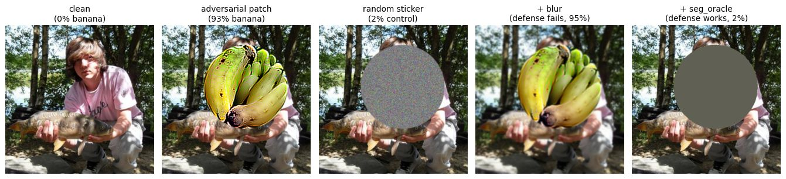

# Results

Academic study, offline, target = **banana**, evaluated on held-out Imagenette validation images.
Every condition is compared on identical patch placements so the only variable is patch *content*:

- **clean** — no patch
- **adversarial** — the trained patch
- **random_patch** — a random-noise patch of the same size and position (control)

The headline patch below (`paper_replica_full`) was trained on 5 backbones — ResNet-18,
MobileNetV3-Large, EfficientNet-B0, DINOv2 ViT-S/14, DINOv2 ViT-B/14 — so **CLIP and SigLIP are
genuine unseen-transfer targets.**

*Left to right: clean photo, adversarial patch, same-size random sticker (control), the patch after
Gaussian blur (attack survives), and after masking the exact patch region (attack removed).*

## 1. Transfer to unseen encoders and chat VLMs

"Says banana" rate at 25% patch area. Clean and random-patch controls were ~0% for every model.

| Model (unseen at train time) | Type | Says banana |
|---|---|---:|
| CLIP ViT-B/32 | image encoder | 88.5% |
| SigLIP ViT-B/16 | image encoder | 74.0% |
| SmolVLM-500M | chat VLM | 90.6% |
| SmolVLM-256M | chat VLM | 75.0% |
| Qwen2.5-VL-3B | chat VLM | 61.0% |

## 2. Defense evaluation

Six preprocessing defenses applied *before* the model sees the image.
`seg_oracle` masks the exact patch region (a perfect-localisation upper bound); `seg_blind` must
find the patch on its own from a gradient-energy map.

### Embedding classifier — adversarial "banana" rate, averaged over 6 encoders

| Defense | Family | Banana rate | vs. none |
|---|---|---:|---:|
| none | — | 93.3% | baseline |
| JPEG q30 | blind transform | 94.3% | +1.0 |
| Gaussian blur | blind transform | 95.5% | +2.2 |
| median filter | blind transform | 94.6% | +1.3 |
| segmentation, blind localiser | find + remove | 92.0% | −1.3 |
| segmentation, **perfect** localiser | oracle | **1.7%** | **−91.6** |

Controls under every defense: clean ~0.2%, random_patch ~2%.

### Embedding classifier — per model, adversarial "banana" rate by defense (%)

| model | none | jpeg_q30 | blur | median | seg_blind | seg_oracle |
|---|---:|---:|---:|---:|---:|---:|
| clip_b32 | 93.0 | 91.5 | 91.5 | 94.0 | 92.0 | 4.5 |
| dinov2_vits14 | 98.0 | 97.0 | 99.5 | 98.5 | 97.0 | 0.0 |
| efficientnet_b0 | 98.0 | 98.0 | 97.5 | 98.0 | 98.0 | 0.5 |
| mobilenet_v3_large | 97.5 | 97.5 | 99.0 | 98.0 | 97.5 | 0.0 |
| resnet18 | 94.5 | 94.5 | 94.5 | 95.0 | 93.5 | 3.5 |
| siglip_b16 | 79.0 | 87.5 | 91.0 | 84.0 | 74.0 | 2.0 |

### VLM (SmolVLM-500M) — "says banana" on adversarial @ 25% area

| Defense | Says banana |
|---|---:|
| clean (no patch) | 0.0% |
| none | 82.8% |
| JPEG q30 | 87.5% |
| Gaussian blur | 98.4% |
| median filter | 93.8% |
| segmentation, blind localiser | 85.9% |
| segmentation, **perfect** localiser | 0.0% |

## Takeaway

The patch transfers across architectures it never trained on, including full chat VLMs, while the
controls stay near zero — so this is the *pattern* exploiting a shared embedding representation, not
mere occlusion. Cheap blind defenses (blur, JPEG, median) do **not** stop it, and blur makes the VLM
*more* confident. The only effective defense removes the exact patch region, which depends on
knowing where the patch is — the part blind localisation does not reliably solve. For any
consequential decision, keep a human in the loop.

_Numbers are from the `paper_replica_full` run on an A100; regenerate with the commands in
[`EXTENSIONS.md`](EXTENSIONS.md). Minor run-to-run variation is expected._
